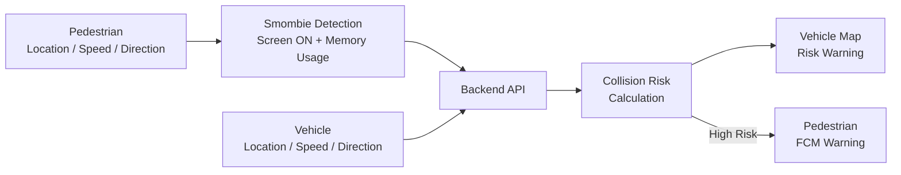
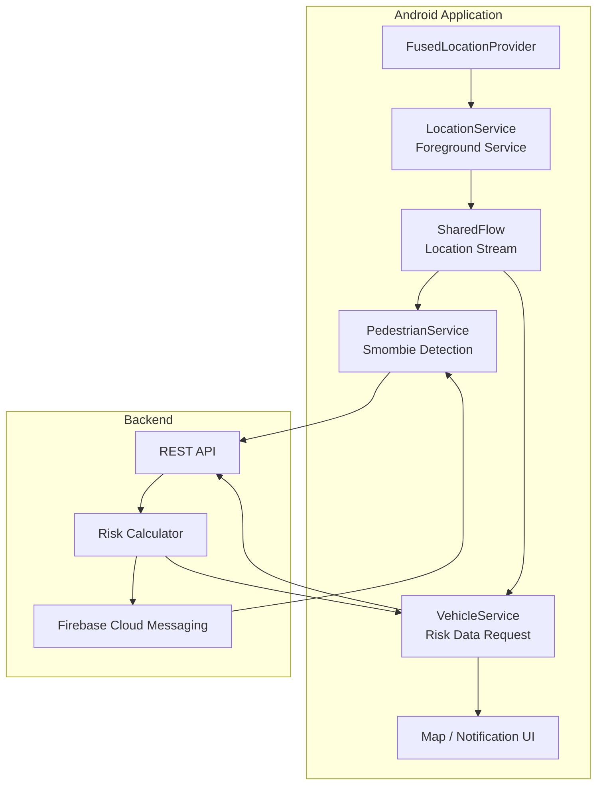
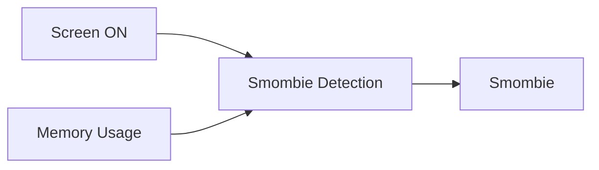
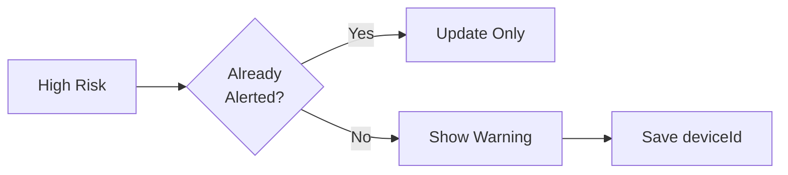
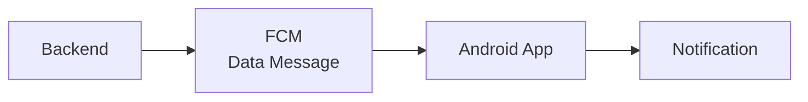
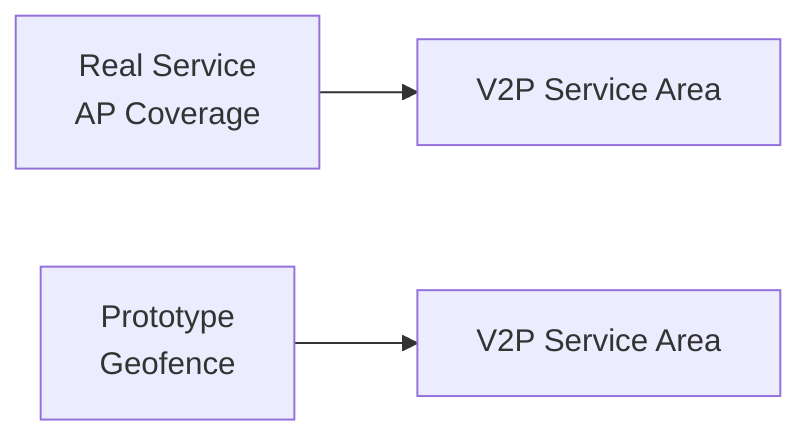

# V2P-Based Smombie Recognition & Alarm Application
> 본 저장소는 **「V2P 기반 스마트폰 보행자 스몸비 인식 및 알림 시스템 개발」** 논문의  
> Android Application 구현을 위한 Repository입니다.
 

V2P(Vehicle-to-Pedestrian) 기반으로 스마트폰을 사용하며 보행하는 사용자를 탐지하고,  
차량과 보행자의 이동 정보를 바탕으로 충돌 위험을 판단해 경고하는 Android 애플리케이션입니다.

## Overview

보행자와 차량의 위치, 속도, 진행 방향을 서버에 전달하고  
계산된 위험도에 따라 차량 지도에 주변 위험 보행자를 표시하고 경고합니다.

보행자의 스마트폰 사용 상태는 화면 활성 상태와 시스템 메모리 사용량을 기반으로 판단하며,  
고위험 상황에서는 FCM을 통해 보행자에게도 경고를 전달합니다.

## System Flow



## Key Features

- Foreground Service 기반 백그라운드 위치 수집
- Screen State와 Memory Usage 기반 스몸비 판정
- SharedFlow 기반 실시간 위치 데이터 처리
- 위치, 속도, 진행 방향 기반 충돌 위험도 계산
- Google Maps 기반 주변 위험 보행자 표시
- 위험도 기반 차량 Notification
- FCM Data Message 기반 보행자 경고
- 동일 위험 대상에 대한 반복 알림 제한
- Geofence 기반 AP 서비스 영역 프로토타이핑

## Architecture



## Smombie Detection

스마트폰을 사용하며 이동하는 보행자를 탐지하기 위해  
화면 활성 상태와 시스템 메모리 사용량을 이용한 경량 휴리스틱을 적용했습니다.



초기에는 Activity Recognition을 함께 사용하는 방식을 검토했지만,  
서비스 목적상 행동 자체를 정밀하게 분류하기보다 스마트폰 사용 가능성이 있는 보행자를 놓치지 않는 것이 중요하다고 판단해 판정 로직을 단순화했습니다.

## Real-time Location Processing

차량과 보행자의 위치를 지속적으로 수집하기 위해 `LocationService`를 Foreground Service로 구성했습니다.

수집된 위치는 `SharedFlow`를 통해 전달하며, 처리 지연이 발생할 경우 오래된 위치보다 최신 위치를 우선하기 위해 제한된 버퍼와 `DROP_OLDEST` 정책을 적용했습니다.

```kotlin
MutableSharedFlow<Location>(
    extraBufferCapacity = 2,
    onBufferOverflow = BufferOverflow.DROP_OLDEST
)
```

UI 화면 이동으로 백그라운드 위치 수집이 중단되지 않도록  
화면의 Lifecycle과 Foreground Service의 Lifecycle도 분리했습니다.

## Alert & Notification

위험 정보는 지속적으로 갱신하되 같은 위험 상황에서 경고가 반복되지 않도록  
이미 알림을 발생시킨 보행자의 `deviceId`를 일정 시간 관리합니다.



FCM은 Notification Message 대신 Data Message 방식으로 구성해  
알림 생성과 표시를 Android 앱에서 직접 제어하도록 변경했습니다.



## Prototype Environment

실제 서비스에서는 AP 통신 범위를 이용해 V2P 서비스 영역을 구성하는 것을 가정했습니다.

프로토타입에서는 별도의 AP 환경을 구축하는 대신 Android `Geofence`를 이용해 서비스 영역을 구현했습니다.



## Tech Stack

**Android**

`Kotlin` `Jetpack Compose` `Coroutines` `SharedFlow`

**Location**

`FusedLocationProvider` `Foreground Service` `Geofence`

**Network**

`Retrofit` `REST API`

**Map & Notification**

`Google Maps` `Firebase Cloud Messaging`

## Related Repository

### Backend

https://github.com/V2P-based-Smombie-Notification-System/V2P-Based-Smombie-Recognition-Backend